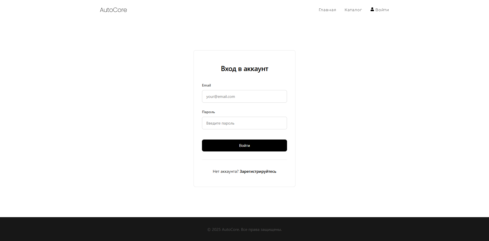
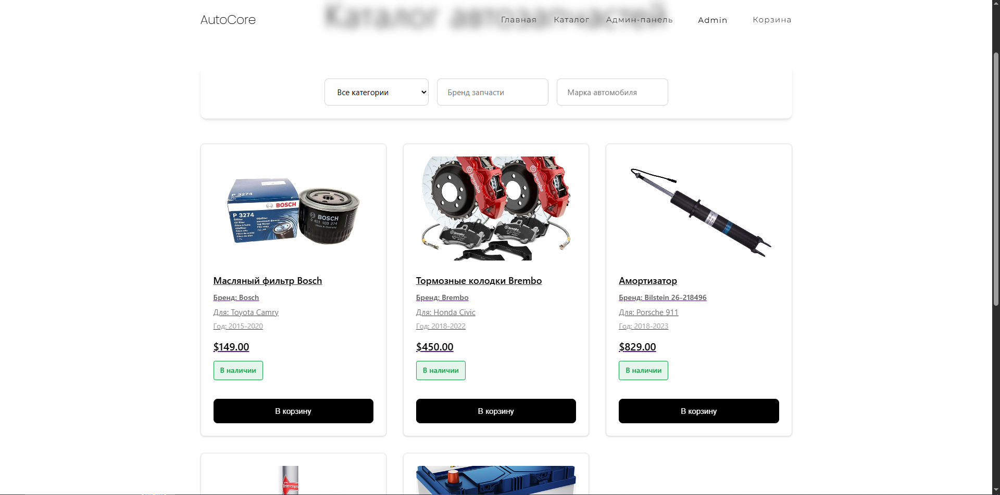
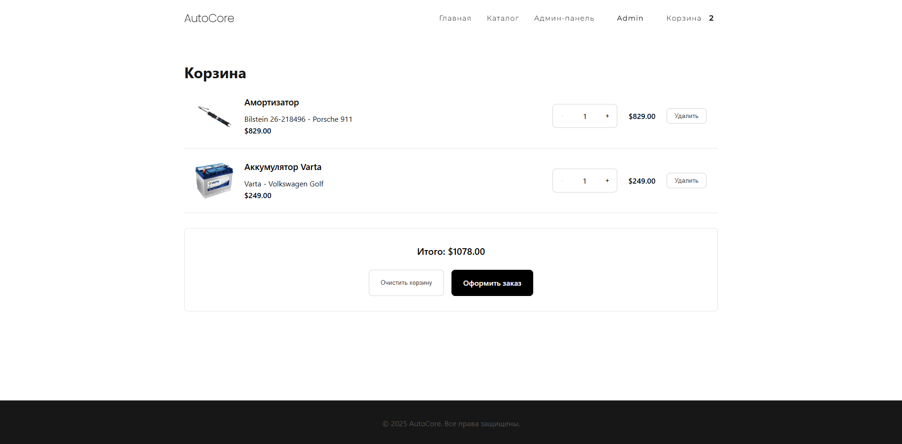
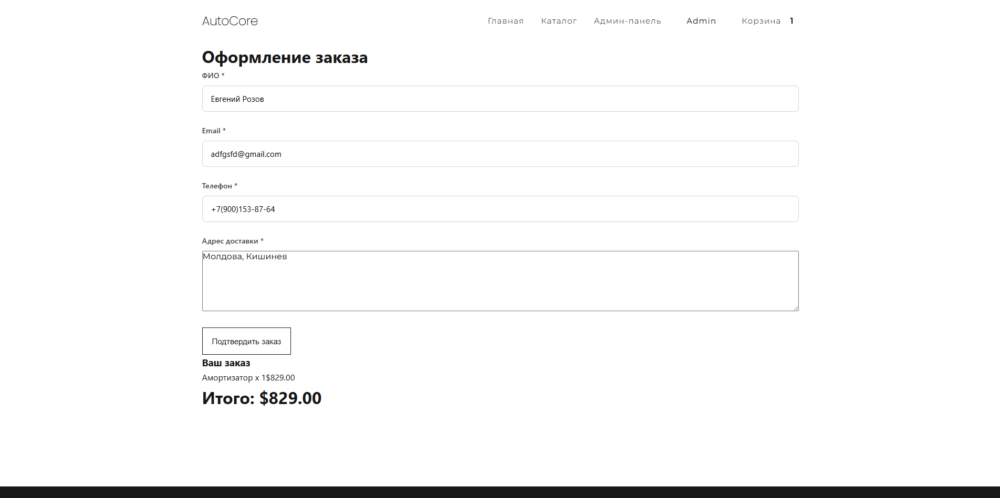

# AutoParts Store

<p align="center"> 
   
</p>

Веб-приложение интернет-магазина для продажи автомобильных запчастей для легковых автомобилей отечественного и зарубежного производства.

## Возможности

### Аутентификация
- Регистрация и вход (JWT)
- Роли пользователей:
  - USER
  - ADMIN
  - Защищённые маршруты

### Каталог товаров

- Просмотр списка автозапчастей
- Детальная страница товара
- Отображение бренда, модели авто и цены
- Проверка наличия товара

### Корзина

- Добавление товаров
- Изменение количества
- Удаление товаров
- Подсчёт общей стоимости

### Оформление заказа

- Доступно только авторизованным пользователям
- Проверка наличия товаров на складе
- Автоматический расчёт суммы
- Привязка заказа к пользователю

### Админ-панель

- Управление товарами (CRUD)
- Добавление новых запчастей
- Редактирование и удаление товаров
- Контроль заказов

## Технологии

### Backend

- Node.js
- Express
- Sequelize
- PostgreSQL
- JWT
- bcrypt

### Frontend

- React
- Vite
- React Router
- Axios
- React Hook Form
- Yup
- React Toastify

## Структура проекта

autoparts-store/
│
├── client/ # React приложение (frontend)
├── server/ # Express API (backend)
├── screenshots/ # Скриншоты проекта
└── README.md

## Скриншоты

### Главная страница
<p align="center"> 
   
</p>

### Авторизация
<p align="center">
  
</p>

### Каталог товаров
<p align="center"> 
   
</p>

### Корзина
<p align="center"> 
   
</p>

### Оформление заказа
<p align="center">
   
</p>

## Установка и запуск

1. Клонирование проекта
```bash
git clone https://github.com/your-username/autoparts-store.git
cd autoparts-store
```

2. Backend
```bash
cd server
npm install
```

3. Создать файл .env:

DB_NAME=your_db_name
DB_USER=your_user
DB_PASSWORD=your_password
DB_HOST=localhost
DB_PORT=5432

JWT_SECRET=your_secret_key

4. Запуск сервера:
```bash
npm run dev
```
5. Запуск клиента
```bash
cd client
npm install
npm run dev
```

6. База данных

Основные сущности:

- User - пользователи (роли: user, admin)
- Product - автозапчасти
- Category - категории товаров
- Order - заказы
- OrderItem - состав заказа

7. API
```md
### Auth
- POST /api/auth/register
- POST /api/auth/login

### Products
- GET /api/products
- GET /api/products/:id
- POST /api/products (admin)
- PUT /api/products/:id (admin)
- DELETE /api/products/:id (admin)

### Orders
POST /api/orders (auth required)
GET /api/orders
```

### Архитектура

- MVC-подход:
  - Routes => Controllers => Models

- Middleware:
  - authMiddleware (JWT проверка)
  - requireAdmin (проверка роли)

Поток работы:

1. Пользователь регистрируется или входит в систему
2. Просматривает каталог автозапчастей
3. Добавляет товары в корзину
4. Оформляет заказ
5. Заказ сохраняется в базе данных
6. Администратор управляет товарами и заказами
